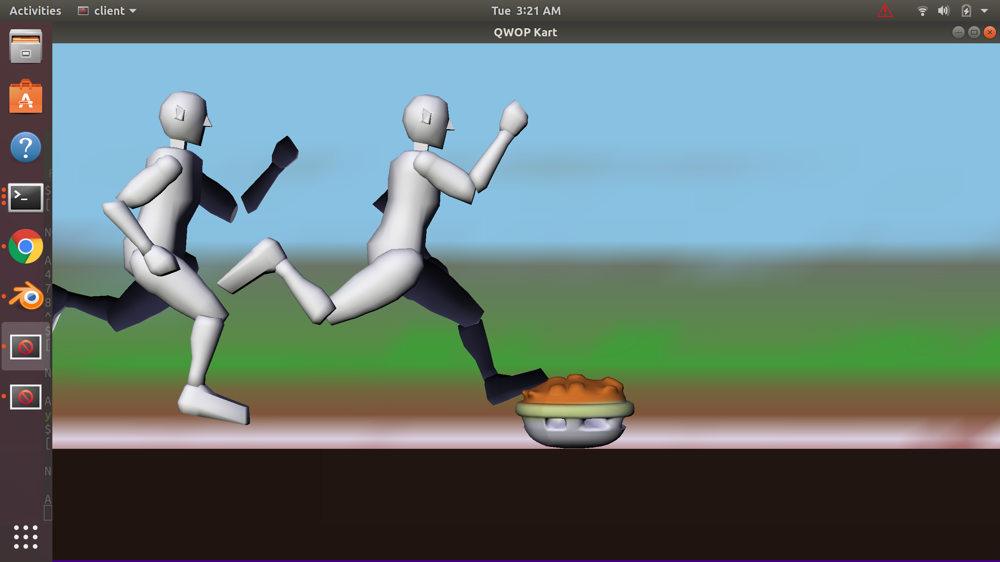

# Game Information

Title: QWOP Kart

Author: Yixin He

Design Document: [QWOP Kart Design Document](http://graphics.cs.cmu.edu/courses/15-466-f18/game2-designs/yixinh/)

Screen Shot:



How To Play:

Use Q to flex your right thigh! Use W to flex your left thigh! Use P to flex your left calf! Use O to flex your right calf! Run into an item to use it! Attempt to jump over it to not use it!

Banana peels will make you go back, star makes you go forward, and shells make you die.


Changes From The Design Document:

The idea of an inventory was done away with for ease of implementation because I ran out of time. The controls were changed a bit to match more with the original QWOP.

Otherwise, nothing explicitly mentioned in the design docs were removed. The limbs are much easier to move than the original QWOP but a) I *technically* did not say I would implement that b)would staying up past 4 am :')

Good / Bad / Ugly Code:

Good: I'm not sure if it's "good" code, but my QWOPs synched up pretty painlessly. Networking didn't cause me too many headaches.

Bad: The way QWOP runs is a bit hacky. The way contact with ground or objects is determed is also very imprecise.

Ugly: The lack of particle dynamics. Despite my excuses above, I definitely wanted to try this but it did not happen. Also ugly is that I'm not sure how to use blender, so positioning objects in my game (like different limbs) is very hacky and magic-number-y.


## Runtime Build Instructions

The runtime code has been set up to be built with [FT Jam](https://www.freetype.org/jam/).

### Getting Jam

For more information on Jam, see the [Jam Documentation](https://www.perforce.com/documentation/jam-documentation) page at Perforce, which includes both reference documentation and a getting started guide.

On unixish OSs, Jam is available from your package manager:
```
	brew install ftjam #on OSX
	apt get ftjam #on Debian-ish Linux
```

On Windows, you can get a binary [from sourceforge](https://sourceforge.net/projects/freetype/files/ftjam/2.5.2/ftjam-2.5.2-win32.zip/download),
and put it somewhere in your `%PATH%`.
(Possibly: also set the `JAM_TOOLSET` variable to `VISUALC`.)

### Libraries

This code uses the [libSDL](https://www.libsdl.org/) library to create an OpenGL context, and the [glm](https://glm.g-truc.net) library for OpenGL-friendly matrix/vector types.
On MacOS and Linux, the code should work out-of-the-box if if you have these installed through your package manager.

If you are compiling on Windows or don't want to install these libraries globally there are pre-built library packages available in the
[kit-libs-linux](https://github.com/ixchow/kit-libs-linux),
[kit-libs-osx](https://github.com/ixchow/kit-libs-osx),
and [kit-libs-win](https://github.com/ixchow/kit-libs-win) repositories.
Simply clone into a subfolder and the build should work.

### Building

Open a terminal (or ```x64 Native Tools Command Prompt for VS 2017``` on Windows), change to the directory containing this code, and type:

```
jam
```

That's it. You can use ```jam -jN``` to run ```N``` parallel jobs if you'd like; ```jam -q``` to instruct jam to quit after the first error; ```jam -dx``` to show commands being executed; or ```jam main.o``` to build a specific file (in this case, main.cpp).  ```jam -h``` will print help on additional options.
